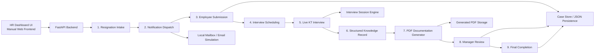
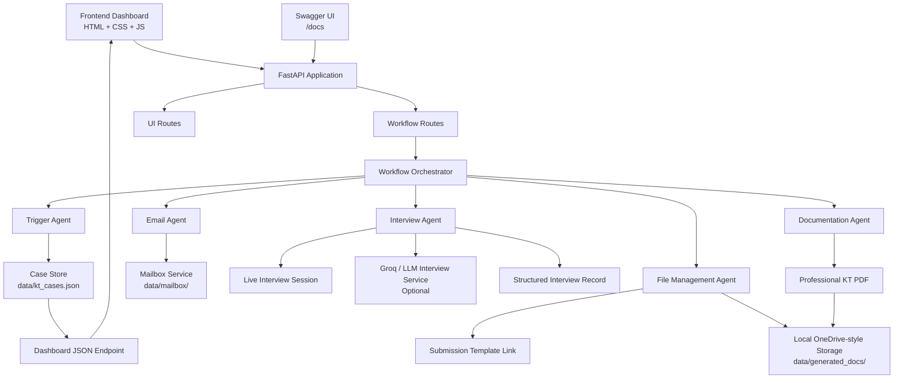
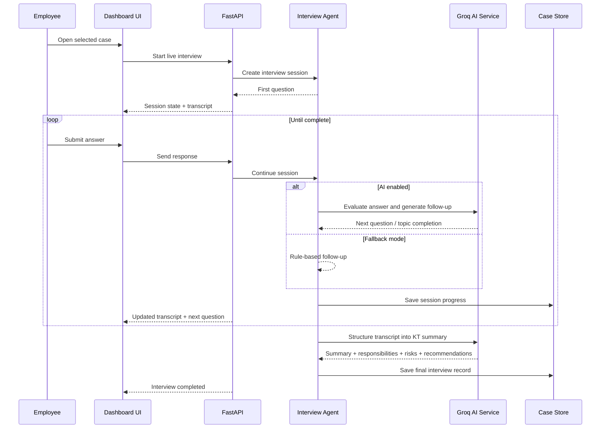

# Knowledge Transfer Agent Project Flow

This diagram summarizes the implemented system architecture and the end-to-end workflow in a format that is easy to read in GitHub or any Markdown viewer that supports Mermaid.

## End-to-End Flow

## System Architecture

## Live Interview Flow

## Short Explanation

- `Frontend Dashboard`: HR-facing UI for cases, intake, live interview, and downloads.
- `FastAPI Backend`: central application server for both API and web UI.
- `Workflow Orchestrator`: coordinates every step of the KT lifecycle.
- `Interview Agent`: runs the live conversational interview and structures knowledge.
- `LLM Interview Service`: optional AI layer for adaptive questioning and stronger summarization.
- `Documentation Agent`: converts the final knowledge record into a professional PDF.
- `Case Store`: persists workflow state for each resignation case.
- `Mailbox + Storage`: local simulation of enterprise email and document platforms.
